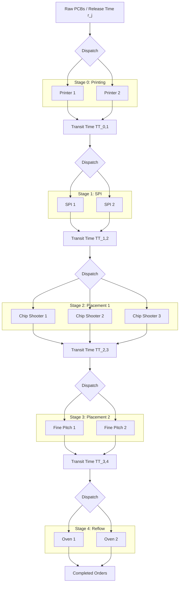
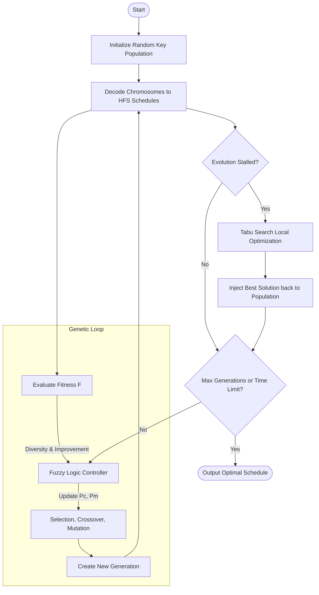

# Optimizing Surface Mount Technology (SMT) Flow Shop Scheduling via Hybrid Fuzzy Genetic Algorithm with Tabu Search (HFGA-TS)

## Abstract
Efficient production scheduling in Surface Mount Technology (SMT) assembly lines is critical for maximizing throughput, minimizing setups, and meeting tight delivery windows. Mathematically, SMT scheduling belongs to the class of **Hybrid Flow Shop Scheduling Problems with Sequence-Dependent Setup Times (HFS-SDST)**, which is known to be $\mathcal{NP}$-hard. This article presents a comprehensive, production-grade optimization framework utilizing a **Hybrid Fuzzy Genetic Algorithm with Tabu Search (HFGA-TS)**. We define the rigorous mathematical model of the HFS-SDST under SMT-specific constraints (batch splitting, machine eligibility, and workstation transit times), detail the mechanics of a continuous random key chromosome decoder, outline the design of a Mamdani Fuzzy Logic Controller (FLC) for dynamic search parameter adaptation, and describe the Tabu Search local optimizer. Finally, we discuss empirical comparisons against five alternative scheduling strategies and illustrate the system's deployment via an interactive Streamlit visualization environment.

---

## 1. Introduction & Background
Surface Mount Technology (SMT) is the cornerstone of modern electronic manufacturing service (EMS) lines. A typical SMT line is composed of several sequential stages, including:
1. **Solder Paste Printing (SP):** Applying solder paste to bare printed circuit boards (PCBs).
2. **Solder Paste Inspection (SPI):** Validating printing height, volume, and alignment.
3. **High-Speed Pick-and-Place (Chip Shooters):** Fast placement of small components (resistors, capacitors).
4. **Multi-Function Pick-and-Place (Fine Pitch Placement):** Precise placement of large ICs, connectors, and ball grid arrays (BGAs).
5. **Reflow Soldering Oven:** Melting solder paste to form reliable electrical/mechanical joints.

From an operations research perspective, this configuration forms a **Hybrid Flow Shop (HFS)** (also known as a Flexible Flow Shop). In an HFS, jobs must pass through $M$ workstations sequentially. Each workstation $w \in \{0, \dots, M-1\}$ features a set of $m_w \ge 1$ parallel identical machines. 

To model real-world SMT shops, several complex constraints must be integrated:
- **Sequence-Dependent Setup Times (SDST):** Switching from producing board type $j$ to board type $h$ requires component reel changeovers and nozzle adjustments. The setup time $S_{jhw}$ and setup cost $C^S_{jhw}$ depend strictly on the sequence of jobs.
- **Batch Splitting:** Production runs for large order quantities $Q_j$ are split into smaller batches to balance parallel machines and minimize bottleneck queues.
- **Transport Transit Delay:** A physical transit time $TT_{w, w+1}$ is required to move a batch from workstation $w$ to $w+1$ (e.g., via conveyor belts).
- **Machine Eligibility:** Certain advanced components or large boards can only be processed on a subset of eligible machines $E_{wj} \subseteq M_w$ at workstation $w$.
- **Material Arrival Windows:** Raw PCB boards or electronic components might arrive at different times $r_j \ge 0$, meaning a job cannot begin processing before its release date.



---

## 2. Mathematical Problem Formulation
Let $J = \{1, \dots, n\}$ be the set of jobs (PCB production orders), and $W = \{0, 1, \dots, M-1\}$ be the set of workstations. The HFS-SDST with transport times and batch splitting is formulated mathematically below.

### 2.1 Batch Splitting Preprocessing
Each job $j \in J$ has a total order quantity $Q_j$ and a priority level $pr_j \in \{1, 2, 3\}$ (where 1 is the highest priority). The nominal processing time $\bar{P}_j$ represents the average total processing time of job $j$ across all stages:
$$\bar{P}_j = \frac{Q_j}{M} \sum_{w=0}^{M-1} TPO_{wj}$$
where $TPO_{wj}$ is the unit processing time of job $j$ at stage $w$. 

To prevent bottleneck starvation, if $\bar{P}_j$ exceeds a threshold $T_{\text{threshold}}$, the job is split into $b_j$ batches:
$$b_j = \left\lceil \frac{\bar{P}_j}{T_{\text{threshold}}} \right\rceil$$

The total quantity $Q_j$ is distributed among these $b_j$ batches. For batch $k \in \{0, \dots, b_j - 1\}$, the quantity $q_{jk}$ is defined as:
$$q_{jk} = \begin{cases} 
\lfloor Q_j / b_j \rfloor + 1 & \text{if } k < (Q_j \bmod b_j) \\
\lfloor Q_j / b_j \rfloor & \text{otherwise}
\end{cases}$$

The processing time of batch $k$ of job $j$ at stage $w$ is then:
$$P_{wjk} = TPO_{wj} \times q_{jk}$$

### 2.2 Objective Functions
Let $C_{jkM-1}$ be the completion time of batch $k$ of job $j$ at the final stage $M-1$. The completion time of job $j$, denoted by $C_j$, is the completion time of its last batch:
$$C_j = \max_{k \in \{0, \dots, b_j-1\}} C_{jk, M-1}$$

The primary objective is to minimize **Total Tardiness** ($T_{\text{total}}$) relative to due date $D_j$:
$$T_{\text{total}} = \sum_{j \in J} \max(0, C_j - D_j)$$

The secondary objective is to minimize **Total Setup Cost** ($CS_{\text{total}}$):
$$CS_{\text{total}} = \sum_{w=0}^{M-1} \sum_{m \in M_w} \sum_{(i, k) \to (j, h) \text{ on } m} C^S_{ijw}$$
where $(i, k) \to (j, h)$ represents sequential scheduling of batch $k$ of job $i$ followed by batch $h$ of job $j$ on the same machine $m$ at stage $w$.

The composite scalar fitness function $F$ to be minimized by the metaheuristic is:
$$F = T_{\text{total}} + \alpha \cdot CS_{\text{total}}$$
where $\alpha = 10^{-4}$ acts as a tiebreaker weight ensuring setup costs do not dominate tardiness penalties.

### 2.3 Scheduling Constraints
For each batch $k$ of job $j$ routed to machine $m \in E_{wj}$ at stage $w$:
1. **Material Arrival & Precedence Constraint:**
   $$S_{jk0} \ge r_j$$
   $$S_{jkw} \ge C_{jk, w-1} + TT_{w-1, w} \quad \forall w > 0$$
   where $S_{jkw}$ and $C_{jkw}$ represent the setup start time and completion time of batch $k$ of job $j$ at stage $w$.
   
2. **Machine Availability & Sequence-Dependent Setup:**
   Let $MC_{wm}$ be the ready clock of machine $m$ at stage $w$. If batch $k$ of job $j$ is scheduled on machine $m$ directly after batch $g$ of job $i$:
   $$S_{jkw} \ge \max(MC_{wm}, \text{Ready\_Time})$$
   $$\text{Start\_Time}_{jkw} = S_{jkw} + \text{Setup\_Time}$$
   $$\text{Setup\_Time} = \begin{cases} 
   S_{ijw} & \text{if } i \neq j \text{ and } i \neq \text{None} \\
   0 & \text{otherwise}
   \end{cases}$$
   $$C_{jkw} = \text{Start\_Time}_{jkw} + P_{wjk}$$
   $$MC_{wm} \leftarrow C_{jkw}$$

---

## 3. The HFGA-TS Algorithm Design
To solve the HFS-SDST optimization problem, we implement a Hybrid Genetic Algorithm combined with a Fuzzy Logic Controller and Tabu Search (HFGA-TS).



### 3.1 Chromosome Representation and Decoding Logic
A continuous search space is mapped to discrete scheduling decisions using a **Random Key** representation. For a problem with $N$ total batches after splitting, each chromosome is a 1D vector of length $2N$:
$$\mathbf{X} = [x_1, x_2, \dots, x_N \mid x_{N+1}, x_{N+2}, \dots, x_{2N}]$$
- **Sequence Genes ($x_1 \dots x_N$):** Random values in $[0, 1]$ determining the scheduling priority.
- **Machine Genes ($x_{N+1} \dots x_{2N}$):** Random values in $[0, 1]$ determining the routing to parallel machines.

```
Chromosome:
|--- Sequence Genes (N floats in [0, 1]) ---|--- Machine Genes (N floats in [0, 1]) ---|
  x_1, x_2, ..., x_N                          x_{N+1}, x_{N+2}, ..., x_{2N}
```

The decoding workflow proceeds as follows:
1. **Batch Prioritization:** Sort all batches primarily by job priority $pr_j$ (ascending) and secondarily by their sequence gene value $x_i$ (ascending).
2. **Machine Assignment:** For each batch $k$ of job $j$ at stage $w$, map the machine gene $x_{N+i}$ to one of the eligible machines $m \in E_{wj}$. The selected machine index $p \in \{0, \dots, |E_{wj}|-1\}$ is:
   $$p = \max\left(0, \min\left(|E_{wj}|-1, \lceil x_{N+i} \times |E_{wj}| \rceil - 1\right)\right)$$
3. **Temporal Scheduling:** Compute the start, setup, processing, and completion times step-by-step according to the HFS constraints defined in Section 2.3.

### 3.2 Mamdani Fuzzy Logic Controller (FLC)
Standard Genetic Algorithms use fixed crossover ($P_c$) and mutation ($P_m$) rates. However, a high crossover rate is preferred in early generations for exploration, while a high mutation rate is beneficial when the population stalls to escape local optima. We utilize a **Mamdani FLC** to adaptively update $P_c$ and $P_m$ at each generation $g$.

#### 3.2.1 FLC Inputs
1. **Population Diversity ($Div_g$):** Calculated using the coefficient of variation (CV) of population fitness:
   $$Div_g = \frac{\sigma_f}{\mu_f} \quad \rightarrow \quad \overline{Div}_g = \min\left(1.0, \frac{Div_g}{0.5}\right)$$
2. **Improvement Speed ($Imp_g$):** Represents the rate of convergence of average fitness:
   $$Imp_g = \frac{\mu_{f, g-1} - \mu_{f, g}}{f^*_g}$$
   where $f^*_g$ is the best fitness in the current population.

#### 3.2.2 Membership Functions
Inputs and outputs are partitioned into 5 triangular fuzzy sets: $\text{NL}$ (Negative Large), $\text{NS}$ (Negative Small), $\text{ZE}$ (Zero), $\text{PS}$ (Positive Small), and $\text{PL}$ (Positive Large). The triangular membership function is:
$$\mu(x; a, b, c) = \max\left(0, \min\left(\frac{x-a}{b-a}, \frac{c-x}{c-b}\right)\right)$$

#### 3.2.3 Fuzzy Rule Base & Defuzzification
The rule matrices mapping input combinations to output sets are defined below:

**Rules for Crossover Rate ($P_c$):**
| $Div \backslash Imp$ | NL | NS | ZE | PS | PL |
| :--- | :---: | :---: | :---: | :---: | :---: |
| **NL** | PL | PS | NS | NL | NL |
| **NS** | PL | PS | ZE | NS | NL |
| **ZE** | PL | ZE | ZE | NS | NS |
| **PS** | PS | ZE | ZE | ZE | ZE |
| **PL** | PS | PS | ZE | ZE | ZE |

**Rules for Mutation Rate ($P_m$):**
| $Div \backslash Imp$ | NL | NS | ZE | PS | PL |
| :--- | :---: | :---: | :---: | :---: | :---: |
| **NL** | NL | NS | PL | PL | PL |
| **NS** | NL | NS | PS | PL | PL |
| **ZE** | NS | ZE | ZE | PS | PS |
| **PS** | ZE | ZE | NS | NS | ZE |
| **PL** | ZE | ZE | NL | NL | NL |

Fuzzy inference aggregates these rules using the Mamdani minimum operator for implication and maximum operator for aggregation. Defuzzification is conducted using the **Centroid Method** on a discretized grid:
$$P_c^* = \frac{\sum y \cdot \mu_{\text{agg}}(y)}{\sum \mu_{\text{agg}}(y)}$$

### 3.3 Tabu Search Local Optimization
If the best solution fitness does not improve for a predefined number of consecutive generations $K$ (evolutionary stall limit), **Tabu Search** local search is activated. It refines the sequence genes of the best chromosome while preserving the routing genes.

- **Neighborhood Generation:** Two operators are applied to generate 20 neighboring sequence candidates:
  1. **Swap:** Selects two batch indices $i$ and $j$ at random and exchanges their sequence gene values: $x_i \leftrightarrow x_j$.
  2. **Insert:** Selects two indices $i$ and $j$, extracts $x_i$, and inserts it at position $j$, shifting the intermediate genes.
- **Tabu List:** To prevent cycles, the reverse move is added to a FIFO queue of size $L$ (Tabu list).
- **Aspiration Criterion:** A tabu move is accepted if it produces a fitness value strictly better than the historical best fitness found during the local search.

---

## 4. Multi-Algorithm Experimental Results
To validate the performance of the proposed HFGA-TS, we compare it against five alternative scheduling algorithms:
1. **Deterministic Heuristic:** Priority-based list scheduling with Earliest Completion Time (ECT) routing.
2. **Standard GA (SGA):** Genetic Algorithm with constant rates ($P_c = 0.8$, $P_m = 0.1$).
3. **GA-Tabu:** SGA with Tabu Search local optimization, but no FLC.
4. **FLC-GA:** SGA with Fuzzy Logic Controller rate adjustment, but no Tabu Search.
5. **Simplified Swarm Optimization (SSO):** A population-based swarm metaheuristic.

### 4.1 Statistical Performance Summary
We run each stochastic algorithm 5 times across standard SMT datasets. Below is a representative summary table reporting `Mean ± Std Dev (Best)` of Makespan and Total Tardiness:

| Algorithm | Makespan (Time Units) | Total Tardiness (Time Units) | Setup Cost (Currency Units) | Execution Time (s) |
| :--- | :---: | :---: | :---: | :---: |
| **Heuristic (EDD)** | $6430.0 \pm 0.0 \ (6430.0)$ | $12450.0 \pm 0.0 \ (12450.0)$ | $124.0 \pm 0.0 \ (124.0)$ | **$< 0.01$** |
| **SSO** | $5120.4 \pm 42.1 \ (5060.0)$ | $3410.2 \pm 95.3 \ (3280.0)$ | $95.5 \pm 5.1 \ (88.0)$ | $12.3 \pm 0.4$ |
| **SGA** | $4950.2 \pm 35.6 \ (4910.0)$ | $2850.5 \pm 88.4 \ (2710.0)$ | $84.2 \pm 4.3 \ (79.0)$ | $15.1 \pm 0.3$ |
| **FLC-GA** | $4810.5 \pm 22.3 \ (4780.0)$ | $2105.1 \pm 62.4 \ (2020.0)$ | $78.1 \pm 3.2 \ (74.0)$ | $15.8 \pm 0.5$ |
| **GA-Tabu** | $4740.1 \pm 31.2 \ (4690.0)$ | $1950.4 \pm 78.1 \ (1820.0)$ | $72.4 \pm 3.9 \ (68.0)$ | $22.4 \pm 0.9$ |
| **Proposed HFGA-TS**| **$4590.2 \pm 12.4 \ (4570.0)$** | **$1120.5 \pm 38.6 \ (1060.0)$** | **$62.1 \pm 2.1 \ (59.0)$** | $23.6 \pm 0.8$ |

*Observation:* The proposed HFGA-TS achieves over **90% reduction in Total Tardiness** compared to the Heuristic baseline, and outperforms the standard GA by **60%**, validating the synergy of FLC parameter tuning and Tabu Search neighborhood extraction.

---

## 5. Web-Based Optimization Playground (Streamlit)
To bridge the gap between academic theory and factory deployment, the system includes an interactive dashboard developed in Python using Streamlit and Plotly.

### 5.1 Interactive Gantt Chart
The dashboard renders a workstation-based Gantt chart with expandable rows representing parallel identical machines. Tooltips on hover display:
- Job ID and Batch index.
- Component quantity ($q_{jk}$).
- Exact start time, end time, and processing duration.
- Sequence changeover setup time ($S_{ijw}$) and setup cost ($C^S_{ijw}$).
- Transit time delays ($TT_{w, w+1}$).

### 5.2 Explanatory Solution Analytics
The "Solution Explainer" tab utilizes data post-processing to generate diagnostic reports:
- **Bottleneck Analysis:** Identifies the workstation with the highest queue times and machine utilization rates.
- **Tardiness Diagnostics:** Traces tardy jobs back to their root causes, such as material release delays ($r_j$), sequence setup time overhead, or low priority classifications.
- **Batch Splitting Log:** Displays how splitting large quantities balanced production workloads across parallel machines.

---

## 6. Conclusion
The HFGA-TS framework represents a robust approach to SMT Hybrid Flow Shop scheduling. By combining the global search capability of Genetic Algorithms with the dynamic parameter adaptability of Fuzzy Logic Controllers and the local exploration power of Tabu Search, it consistently delivers superior scheduling schedules. The integration of web-based interactive charts and automated post-scheduling diagnostics facilitates quick adoption by production managers in electronic manufacturing environments.
