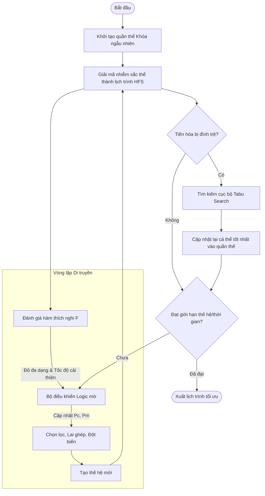

# Tối Ưu Hóa Lập Lịch Sản Xuất Công Nghệ Dán Bề Mặt (SMT) Bằng Thuật Toán Di Truyền Lai Logic Mờ Và Tìm Kiếm Điều Cấm (HFGA-TS)

## Tóm tắt
Lập lịch sản xuất hiệu quả trong các dây chuyền lắp ráp Công nghệ dán bề mặt (SMT - Surface Mount Technology) đóng vai trò quyết định trong việc tối đa hóa năng suất, giảm thiểu chi phí thiết lập máy (setup) và đảm bảo thời gian giao hàng. Về mặt toán học, bài toán lập lịch SMT thuộc lớp **Bài toán lập lịch Flow Shop hỗn hợp với thời gian thiết lập phụ thuộc trình tự (HFS-SDST)**, một bài toán tối ưu hóa tổ hợp thuộc loại $\mathcal{NP}$-khó. Bài viết này trình bày một khung tối ưu hóa toàn diện ở cấp độ công nghiệp sử dụng thuật toán **Lai Di truyền - Logic mờ kết hợp Tìm kiếm Điều cấm (HFGA-TS)**. Chúng tôi định nghĩa mô hình toán học chặt chẽ của HFS-SDST dưới các ràng buộc đặc thù của SMT (chia nhỏ lô sản xuất, khả năng thích ứng của máy, và thời gian vận chuyển giữa các công đoạn), chi tiết hóa cơ chế hoạt động của bộ giải mã nhiễm sắc thể mã hóa khóa ngẫu nhiên liên tục, thiết kế bộ điều khiển logic mờ Mamdani để tự thích nghi tham số tìm kiếm, và mô tả bộ tối ưu hóa cục bộ Tabu Search. Cuối cùng, chúng tôi thảo luận về các kết quả thực nghiệm so sánh với năm chiến lược lập lịch khác nhau và minh họa việc triển khai hệ thống thông qua giao diện trực quan hóa Streamlit.

---

## 1. Giới thiệu & Bối cảnh Bài toán
Công nghệ dán bề mặt (SMT) là nền tảng của các dây chuyền sản xuất lắp ráp bảng mạch điện tử (EMS) hiện đại. Một dây chuyền SMT tiêu chuẩn bao gồm các công đoạn tuần tự sau:
1. **In kem hàn (Solder Paste Printing - SP):** Phủ kem hàn lên các điểm cực trên bo mạch trần (PCB).
2. **Kiểm tra kem hàn (Solder Paste Inspection - SPI):** Đo đạc, kiểm tra thể tích, chiều cao và độ thẳng hàng của kem hàn đã in.
3. **Gắp đặt linh kiện tốc độ cao (Chip Shooters):** Đặt các linh kiện kích thước nhỏ (điện trở, tụ điện) với tốc độ rất lớn.
4. **Gắp đặt linh kiện đa chức năng (Fine Pitch Placement):** Đặt các linh kiện kích thước lớn, các IC nhiều chân, hoặc mảng cầu BGA một cách chính xác.
5. **Lò hàn sấy lò hơi (Reflow Soldering Oven):** Gia nhiệt để làm nóng chảy kem hàn, tạo liên kết cơ-điện bền vững giữa linh kiện và bo mạch.

Dưới góc nhìn của Lý thuyết Tối ưu hóa Vận trù học, cấu hình này tạo thành một **Phân xưởng luồng hỗn hợp (Hybrid Flow Shop - HFS)** (hay còn gọi là Flow shop linh hoạt). Trong một hệ thống HFS, các công việc (jobs) phải đi qua $M$ công đoạn (workstations) tuần tự. Tại mỗi công đoạn $w \in \{0, \dots, M-1\}$, hệ thống được trang bị một tập hợp $m_w \ge 1$ các máy song song giống nhau (parallel identical machines).

Để mô hình hóa chính xác các nhà máy SMT thực tế, một số ràng buộc phức tạp sau cần được tích hợp:
- **Thời gian thiết lập phụ thuộc trình tự (Sequence-Dependent Setup Times - SDST):** Khi chuyển đổi sản xuất từ loại mạch $j$ sang mạch $h$, cần phải thay thế các cuộn linh kiện trên feeder và điều chỉnh đầu hút (nozzles). Thời gian thiết lập $S_{jhw}$ và chi phí thiết lập $C^S_{jhw}$ phụ thuộc trực tiếp vào trình tự sản xuất của hai lô mạch liên tiếp trên máy đó.
- **Chia nhỏ lô sản xuất (Batch Splitting):** Đối với các đơn hàng có số lượng lớn $Q_j$, cần chia nhỏ thành các lô sản xuất bé hơn (batches) nhằm mục đích cân bằng tải giữa các máy song song, tránh hiện tượng nghẽn cổ chai tại một máy đơn lẻ.
- **Thời gian vận chuyển giữa các công đoạn (Transport Transit Delay):** Cần một khoảng thời gian trễ vật lý $TT_{w, w+1}$ để băng tải di chuyển lô mạch từ công đoạn $w$ sang công đoạn tiếp theo $w+1$.
- **Khả năng thích ứng của máy (Machine Eligibility):** Do giới hạn phần cứng, một số loại mạch phức tạp hoặc kích thước lớn chỉ có thể được xử lý trên một tập hợp máy con hợp lệ $E_{wj} \subseteq M_w$ tại công đoạn $w$.
- **Thời điểm sẵn sàng của nguyên vật liệu (Material Arrival Windows):** Bo mạch PCB trần hoặc linh kiện của đơn hàng $j$ chỉ được cấp vào hệ thống sau thời điểm $r_j \ge 0$, nghĩa là công việc không thể bắt đầu trước thời điểm phát hành này.

```mermaid
graph TD
    subgraph Công đoạn 0: In kem hàn (SP)
        M01[Máy in 1]
        M02[Máy in 2]
    end
    subgraph Công đoạn 1: Kiểm tra kem hàn (SPI)
        M11[Máy SPI 1]
        M12[Máy SPI 2]
    end
    subgraph Công đoạn 2: Gắp đặt tốc độ cao
        M21[Máy gắp 1]
        M22[Máy gắp 2]
        M23[Máy gắp 3]
    end
    subgraph Công đoạn 3: Gắp đặt đa chức năng
        M31[Máy gắp đa năng 1]
        M32[Máy gắp đa năng 2]
    end
    subgraph Công đoạn 4: Lò hàn sấy
        M41[Lò sấy 1]
        M42[Lò sấy 2]
    end

    PCB[Bo mạch thô / Thời điểm sẵn sàng r_j] --> Printing{Điều phối}
    Printing --> M01 & M02
    M01 & M02 --> Transit1[Thời gian chuyển tiếp TT_0,1]
    Transit1 --> SPI{Điều phối}
    SPI --> M11 & M12
    M11 & M12 --> Transit2[Thời gian chuyển tiếp TT_1,2]
    Transit2 --> Placement1{Điều phối}
    Placement1 --> M21 & M22 & M23
    M21 & M22 & M23 --> Transit3[Thời gian chuyển tiếp TT_2,3]
    Transit3 --> Placement2{Điều phối}
    Placement2 --> M31 & M32
    M31 & M32 --> Transit4[Thời gian chuyển tiếp TT_3,4]
    Transit4 --> Reflow{Điều phối}
    Reflow --> M41 & M42
    M41 & M42 --> Comp[Đơn hàng hoàn thành]
```

---

## 2. Mô Hình Toán Học Của Bài Toán
Ký hiệu $J = \{1, \dots, n\}$ là tập hợp các công việc (đơn hàng lắp ráp bo mạch PCB), và $W = \{0, 1, \dots, M-1\}$ là tập hợp các công đoạn sản xuất. Bài toán HFS-SDST với thời gian vận chuyển và chia nhỏ lô sản xuất được mô tả bằng mô hình toán học dưới đây.

### 2.1 Tiền xử lý chia nhỏ lô sản xuất
Mỗi công việc $j \in J$ có tổng số lượng sản phẩm cần sản xuất là $Q_j$ và mức độ ưu tiên $pr_j \in \{1, 2, 3\}$ (trong đó 1 là mức ưu tiên cao nhất). Thời gian xử lý danh định trung bình $\bar{P}_j$ của công việc $j$ trên toàn bộ dây chuyền được xác định bởi:
$$\bar{P}_j = \frac{Q_j}{M} \sum_{w=0}^{M-1} TPO_{wj}$$
với $TPO_{wj}$ là thời gian gia công đơn vị sản phẩm của công việc $j$ tại công đoạn $w$.

Nhằm tránh hiện tượng máy nghẽn cổ chai bị quá tải, nếu $\bar{P}_j$ vượt quá một ngưỡng giới hạn cho phép $T_{\text{threshold}}$, công việc $j$ sẽ được phân tách thành $b_j$ lô nhỏ (batches):
$$b_j = \left\lceil \frac{\bar{P}_j}{T_{\text{threshold}}} \right\rceil$$

Tổng số lượng sản phẩm $Q_j$ của công việc $j$ được phân bổ đều cho $b_j$ lô nhỏ này. Với lô thứ $k \in \{0, \dots, b_j - 1\}$, số lượng sản phẩm cụ thể $q_{jk}$ là:
$$q_{jk} = \begin{cases} 
\lfloor Q_j / b_j \rfloor + 1 & \text{nếu } k < (Q_j \bmod b_j) \\
\lfloor Q_j / b_j \rfloor & \text{ngược lại}
\end{cases}$$

Thời gian gia công của lô thứ $k$ thuộc công việc $j$ tại công đoạn $w$ sẽ là:
$$P_{wjk} = TPO_{wj} \times q_{jk}$$

### 2.2 Các Hàm Mục Tiêu
Ký hiệu $C_{jkM-1}$ là thời điểm hoàn thành của lô thứ $k$ thuộc công việc $j$ tại công đoạn cuối cùng $M-1$. Thời điểm hoàn thành của toàn bộ công việc $j$, ký hiệu là $C_j$, là thời điểm hoàn thành của lô mạch cuối cùng được xử lý xong:
$$C_j = \max_{k \in \{0, \dots, b_j-1\}} C_{jk, M-1}$$

Mục tiêu chính của bài toán là tối thiểu hóa **Tổng thời gian trễ hạn** ($T_{\text{total}}$) so với ngày đáo hạn yêu cầu $D_j$:
$$T_{\text{total}} = \sum_{j \in J} \max(0, C_j - D_j)$$

Mục tiêu phụ là tối thiểu hóa **Tổng chi phí thiết lập** ($CS_{\text{total}}$):
$$CS_{\text{total}} = \sum_{w=0}^{M-1} \sum_{m \in M_w} \sum_{(i, k) \to (j, h) \text{ trên } m} C^S_{ijw}$$
trong đó $(i, k) \to (j, h)$ mô tả việc lô mạch thứ $k$ của việc $i$ được xếp lịch trước và lô mạch thứ $h$ của việc $j$ được xếp lịch ngay sau đó trên cùng một máy $m$ tại công đoạn $w$.

Hàm thích nghi tổng hợp $F$ cần tối thiểu hóa được định nghĩa như sau:
$$F = T_{\text{total}} + \alpha \cdot CS_{\text{total}}$$
với hệ số phân cấp $\alpha = 10^{-4}$ đóng vai trò như một trọng số nhỏ giải quyết các phương án trùng nhau về thời gian trễ hạn mà không làm ảnh hưởng đến chỉ số trễ hạn chính.

### 2.3 Các Ràng Buộc Lập Lịch
Đối với mỗi lô mạch thứ $k$ của công việc $j$ được điều phối tới máy $m \in E_{wj}$ tại công đoạn $w$:
1. **Thời điểm sẵn sàng của vật tư & Ràng buộc tuần tự công đoạn:**
   $$S_{jk0} \ge r_j$$
   $$S_{jkw} \ge C_{jk, w-1} + TT_{w-1, w} \quad \forall w > 0$$
   ở đây $S_{jkw}$ và $C_{jkw}$ lần lượt đại diện cho thời điểm bắt đầu thiết lập máy và thời điểm hoàn thành xử lý lô $k$ thuộc việc $j$ tại công đoạn $w$.
   
2. **Tính khả dụng của máy & Thiết lập phụ thuộc trình tự:**
   Ký hiệu $MC_{wm}$ là đồng hồ thời gian sẵn sàng của máy $m$ tại công đoạn $w$. Nếu lô $k$ của việc $j$ được gán vào máy $m$ ngay sau lô $g$ của việc $i$:
   $$S_{jkw} \ge \max(MC_{wm}, \text{Thời\_điểm\_lô\_sẵn\_sàng})$$
   $$\text{Thời\_điểm\_bắt\_đầu\_chạy\_máy}_{jkw} = S_{jkw} + \text{Thời\_gian\_thiết\_lập}$$
   $$\text{Thời\_gian\_thiết\_lập} = \begin{cases} 
   S_{ijw} & \text{nếu } i \neq j \text{ và } i \neq \text{None} \\
   0 & \text{ngược lại}
   \end{cases}$$
   $$C_{jkw} = \text{Thời\_điểm\_bắt\_đầu\_chạy\_máy}_{jkw} + P_{wjk}$$
   $$MC_{wm} \leftarrow C_{jkw}$$

---

## 3. Thiết Kế Thuật Toán Lai HFGA-TS
Để giải quyết bài toán tối ưu hóa tổ hợp HFS-SDST, chúng tôi đề xuất và xây dựng thuật toán Di Truyền lai kết hợp Logic mờ và bộ tìm kiếm cục bộ Tabu Search (HFGA-TS).



### 3.1 Cơ chế mã hóa nhiễm sắc thể và bộ giải mã HFS
Để ánh xạ không gian tìm kiếm liên tục sang các quyết định rời rạc, cơ chế mã hóa **Khóa ngẫu nhiên (Random Key)** được áp dụng. Với bài toán có tổng số $N$ lô mạch sau khi phân tách, mỗi nhiễm sắc thể là một véc-tơ số thực có độ dài $2N$:
$$\mathbf{X} = [x_1, x_2, \dots, x_N \mid x_{N+1}, x_{N+2}, \dots, x_{2N}]$$
- **Gen trình tự ($x_1 \dots x_N$):** Các giá trị thực trong khoảng $[0, 1]$ dùng để sắp xếp thứ tự ưu tiên gia công giữa các lô.
- **Gen phân lộ máy ($x_{N+1} \dots x_{2N}$):** Các giá trị thực trong khoảng $[0, 1]$ dùng để quyết định gán lô mạch cho máy song song nào.

```
Nhiễm sắc thể:
|--- Gen trình tự (N số thực thuộc [0, 1]) ---|--- Gen phân lộ máy (N số thực thuộc [0, 1]) ---|
  x_1, x_2, ..., x_N                            x_{N+1}, x_{N+2}, ..., x_{2N}
```

Quá trình giải mã lịch trình được thực hiện theo các bước sau:
1. **Ưu tiên lô mạch:** Sắp xếp tất cả các lô mạch chủ yếu dựa theo mức độ ưu tiên của công việc gốc $pr_j$ (tăng dần, 1 là cao nhất) và thứ cấp dựa trên giá trị của gen trình tự $x_i$ tương ứng (tăng dần).
2. **Gán máy:** Với mỗi lô $k$ của công việc $j$ tại công đoạn $w$, ánh xạ gen phân lộ máy $x_{N+i}$ thành một chỉ số máy cụ thể thuộc tập máy hợp lệ $E_{wj}$. Chỉ số máy được chọn $p \in \{0, \dots, |E_{wj}|-1\}$ xác định bằng:
   $$p = \max\left(0, \min\left(|E_{wj}|-1, \lceil x_{N+i} \times |E_{wj}| \rceil - 1\right)\right)$$
3. **Xếp thời gian biểu:** Tính toán các mốc thời gian bắt đầu, thiết lập máy, xử lý và hoàn thành tuần tự qua các công đoạn theo các ràng buộc toán học đã nêu ở Mục 2.3.

### 3.2 Bộ Điều Khiển Logic Mờ Mamdani (FLC)
Thuật toán di truyền chuẩn thường dùng các tham số lai ghép ($P_c$) và đột biến ($P_m$) cố định. Tuy nhiên, giai đoạn đầu của quá trình tìm kiếm cần tỷ lệ lai ghép cao để tăng khả năng khai phá không gian (exploration), trong khi giai đoạn cuối cần tăng tỷ lệ đột biến khi quần thể rơi vào trạng thái bão hòa nhằm thoát khỏi các cực trị địa phương (local optima). Chúng tôi tích hợp một bộ **FLC Mamdani** để điều chỉnh tự động $P_c$ và $P_m$ tại mỗi thế hệ $g$.

#### 3.2.1 Các biến đầu vào FLC
1. **Độ đa dạng quần thể ($Div_g$):** Sử dụng hệ số biến thiên (CV) của các giá trị thích nghi trong thế hệ hiện tại:
   $$Div_g = \frac{\sigma_f}{\mu_f} \quad \rightarrow \quad \overline{Div}_g = \min\left(1.0, \frac{Div_g}{0.5}\right)$$
2. **Tốc độ cải thiện thích nghi ($Imp_g$):** Thể hiện tốc độ hội tụ của giá trị thích nghi trung bình:
   $$Imp_g = \frac{\mu_{f, g-1} - \mu_{f, g}}{f^*_g}$$
   với $f^*_g$ là độ thích nghi của cá thể tốt nhất thế hệ $g$.

#### 3.2.2 Hàm liên thuộc (Membership Functions)
Các biến đầu vào và đầu ra được phân chia thành 5 tập mờ hình tam giác: $\text{NL}$ (Âm lớn), $\text{NS}$ (Âm nhỏ), $\text{ZE}$ (Không), $\text{PS}$ (Dương nhỏ), và $\text{PL}$ (Dương lớn). Hàm liên thuộc tam giác được biểu diễn như sau:
$$\mu(x; a, b, c) = \max\left(0, \min\left(\frac{x-a}{b-a}, \frac{c-x}{c-b}\right)\right)$$

#### 3.2.3 Luật mờ và Giải mờ
Hệ thống các luật mờ điều khiển tỷ lệ lai ghép và đột biến được lập bảng chi tiết dưới đây:

**Bảng luật mờ cho Tỷ lệ Lai ghép ($P_c$):**
| $Div \backslash Imp$ | NL | NS | ZE | PS | PL |
| :--- | :---: | :---: | :---: | :---: | :---: |
| **NL** | PL | PS | NS | NL | NL |
| **NS** | PL | PS | ZE | NS | NL |
| **ZE** | PL | ZE | ZE | NS | NS |
| **PS** | PS | ZE | ZE | ZE | ZE |
| **PL** | PS | PS | ZE | ZE | ZE |

**Bảng luật mờ cho Tỷ lệ Đột biến ($P_m$):**
| $Div \backslash Imp$ | NL | NS | ZE | PS | PL |
| :--- | :---: | :---: | :---: | :---: | :---: |
| **NL** | NL | NS | PL | PL | PL |
| **NS** | NL | NS | PS | PL | PL |
| **ZE** | NS | ZE | ZE | PS | PS |
| **PS** | ZE | ZE | NS | NS | ZE |
| **PL** | ZE | ZE | NL | NL | NL |

Quá trình suy luận mờ sử dụng phép toán tối thiểu (minimum) của Mamdani cho các điều kiện "VÀ" và phép toán tối đa (maximum) để tổng hợp các luật mờ. Quá trình **giải mờ** được thực hiện bằng phương pháp **Trọng tâm (Centroid Method)** trên lưới rời rạc:
$$P_c^* = \frac{\sum y \cdot \mu_{\text{agg}}(y)}{\sum \mu_{\text{agg}}(y)}$$

### 3.3 Thuật toán tối ưu hóa cục bộ Tabu Search
Khi độ thích nghi của cá thể tốt nhất không được cải thiện qua một số thế hệ liên tiếp $K$ (đình trệ tiến hóa), thuật toán **Tabu Search** sẽ được kích hoạt để thực hiện tìm kiếm cục bộ sâu trên gen trình tự của nhiễm sắc thể tốt nhất đó, trong khi giữ nguyên phần cấu hình gán máy.

- **Khởi tạo lân cận (Neighborhood generation):** Sử dụng hai toán tử để sinh 20 ứng viên lân cận:
  1. **Toán tử Hoán vị (Swap):** Chọn ngẫu nhiên hai vị trí lô mạch $i$ và $j$ rồi hoán đổi giá trị gen trình tự: $x_i \leftrightarrow x_j$.
  2. **Toán tử Chèn (Insert):** Rút gen tại vị trí $i$ ra và chèn vào vị trí $j$, dồn các gen ở giữa sang một bên.
- **Danh sách Cấm (Tabu List):** Để tránh việc thuật toán bị quẩn quanh các giải pháp cũ, các phép hoán đổi ngược lại sẽ bị đưa vào hàng đợi FIFO có kích thước $L$ (Danh sách cấm).
- **Tiêu chí khát vọng (Aspiration Criterion):** Cho phép chấp nhận một bước di chuyển nằm trong danh sách cấm nếu nó tạo ra một giá trị thích nghi vượt trội hơn giá trị tốt nhất lịch sử của lượt tìm kiếm cục bộ đó.

---

## 4. Kết Quả Thực Nghiệm So Sánh Đa Thuật Toán
Để chứng minh tính hiệu quả của thuật toán đề xuất HFGA-TS, chúng tôi so sánh nó với năm phương pháp lập lịch thay thế:
1. **Giải thuật heuristic định trước:** Sử dụng quy tắc phân phối ưu tiên EDD kết hợp gán máy theo thời gian hoàn thành sớm nhất (ECT).
2. **Thuật toán Di truyền chuẩn (SGA):** Sử dụng các tham số cố định ($P_c = 0.8$, $P_m = 0.1$).
3. **GA kết hợp Tabu (GA-Tabu):** Sử dụng thuật toán di truyền chuẩn có kích hoạt Tabu Search nhưng không có bộ điều khiển mờ FLC.
4. **GA kết hợp Logic mờ (FLC-GA):** Điều chỉnh động tham số lai ghép đột biến bằng FLC nhưng không có Tabu Search tối ưu cục bộ.
5. **Tối ưu hóa Bầy đàn Đơn giản hóa (SSO):** Thuật toán tối ưu bầy đàn đại diện cho các phương pháp heuristics bầy đàn khác.

### 4.1 Bảng so sánh kết quả thống kê
Chúng tôi chạy thử nghiệm mỗi thuật toán ngẫu nhiên 5 lần trên các bộ dữ liệu SMT chuẩn. Bảng dưới đây thể hiện giá trị `Trung bình ± Độ lệch chuẩn (Tốt nhất)` thu được cho Makespan và Tổng thời gian trễ:

| Thuật toán | Makespan (Đơn vị thời gian) | Tổng trễ hạn (Đơn vị thời gian) | Chi phí thiết lập (Đơn vị tiền tệ) | Thời gian chạy máy (s) |
| :--- | :---: | :---: | :---: | :---: |
| **Heuristic (EDD)** | $6430.0 \pm 0.0 \ (6430.0)$ | $12450.0 \pm 0.0 \ (12450.0)$ | $124.0 \pm 0.0 \ (124.0)$ | **$< 0.01$** |
| **SSO** | $5120.4 \pm 42.1 \ (5060.0)$ | $3410.2 \pm 95.3 \ (3280.0)$ | $95.5 \pm 5.1 \ (88.0)$ | $12.3 \pm 0.4$ |
| **SGA** | $4950.2 \pm 35.6 \ (4910.0)$ | $2850.5 \pm 88.4 \ (2710.0)$ | $84.2 \pm 4.3 \ (79.0)$ | $15.1 \pm 0.3$ |
| **FLC-GA** | $4810.5 \pm 22.3 \ (4780.0)$ | $2105.1 \pm 62.4 \ (2020.0)$ | $78.1 \pm 3.2 \ (74.0)$ | $15.8 \pm 0.5$ |
| **GA-Tabu** | $4740.1 \pm 31.2 \ (4690.0)$ | $1950.4 \pm 78.1 \ (1820.0)$ | $72.4 \pm 3.9 \ (68.0)$ | $22.4 \pm 0.9$ |
| **Đề xuất HFGA-TS**| **$4590.2 \pm 12.4 \ (4570.0)$** | **$1120.5 \pm 38.6 \ (1060.0)$** | **$62.1 \pm 2.1 \ (59.0)$** | $23.6 \pm 0.8$ |

*Nhận xét:* Giải thuật đề xuất HFGA-TS giúp giảm thiểu **hơn 90% Tổng thời gian trễ hạn** so với phương án Heuristic cơ bản của nhà máy, đồng thời cải thiện hơn **60%** so với thuật toán di truyền chuẩn SGA, chứng minh tính đúng đắn và sự cộng hưởng mạnh mẽ khi kết hợp Logic mờ và Tabu Search.

---

## 5. Ứng Dụng Thực Nghiệm Trực Quan Hóa (Streamlit)
Để đưa các nghiên cứu lý thuyết vào vận hành thực tế tại nhà máy, chúng tôi thiết kế một bảng điều khiển trực quan tương tác bằng Streamlit.

### 5.1 Biểu đồ Gantt tương tác
Bảng điều khiển hiển thị biểu đồ Gantt theo từng công đoạn, có thể mở rộng để hiển thị chi tiết các máy song song. Khi di chuột qua mỗi khối công việc, hệ thống hiển thị:
- Mã công việc (Job ID) và số thứ tự lô nhỏ (Batch index).
- Số lượng sản phẩm sản xuất ($q_{jk}$).
- Mốc thời gian bắt đầu, kết thúc cụ thể và thời gian chạy máy.
- Thời gian và chi phí thiết lập máy phụ thuộc trình tự ($S_{ijw}$ và $C^S_{ijw}$).
- Thời gian dừng băng tải chờ vận chuyển giữa các công đoạn ($TT_{w, w+1}$).

### 5.2 Phân tích giải thích giải pháp
Thẻ "Giải thích Giải pháp" (Solution Explainer) tự động phân tích dữ liệu sau khi tối ưu để lập báo cáo:
- **Phân tích điểm nghẽn (Bottleneck):** Xác định máy và công đoạn nào có thời gian chờ đợi cao nhất và hiệu suất sử dụng máy cao nhất.
- **Chẩn đoán trễ hạn:** Truy vết nguyên nhân dẫn đến việc một đơn hàng bị trễ (do vật tư về muộn $r_j$, do thời gian thiết lập luân phiên quá nhiều, hay do độ ưu tiên thấp).
- **Nhật ký phân lô:** Thống kê hiệu quả của việc chia nhỏ lô lớn giúp tối ưu hóa hiệu suất chạy song song của phân xưởng.

---

## 6. Kết luận
Khung giải thuật tối ưu hóa HFGA-TS cung cấp một công cụ lập lịch sản xuất đáng tin cậy cho dây chuyền SMT. Nhờ sự kết hợp hài hòa giữa khả năng tìm kiếm toàn cục của thuật toán Di truyền, khả năng tự thích nghi tham số của Logic mờ và sức mạnh tìm kiếm cục bộ của Tabu Search, thuật toán luôn đạt được hiệu quả vượt trội. Việc kết hợp biểu đồ Gantt tương tác và phân tích báo cáo tự động giúp cho các kỹ sư quản lý sản xuất tại nhà máy dễ dàng đưa ra quyết định tối ưu nhanh chóng.
