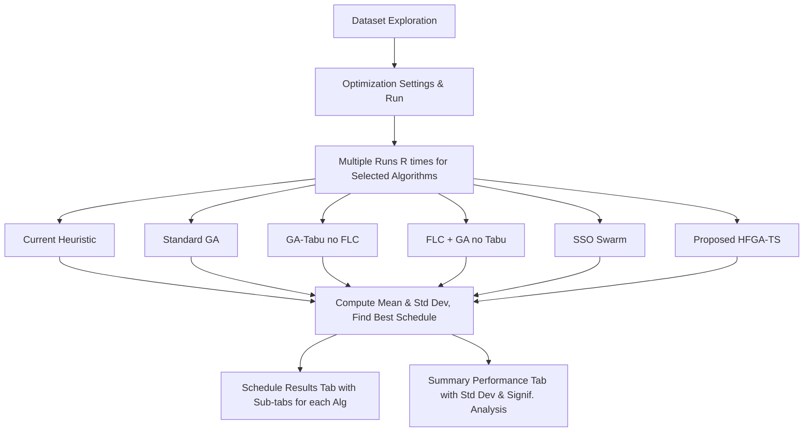

# Implementation Plan - Multi-Algorithm Scheduling Comparison

This plan outlines the design and implementation details for expanding the SMT scheduling system to compare multiple optimization algorithms:
1. **Current Method (Heuristic Baseline):** Priority-based list scheduling with Earliest Completion Time (ECT) machine assignment.
2. **Standard GA (no FLC, no Tabu Search):** Constant crossover and mutation rates.
3. **Hybrid GA-Tabu without FLC:** Constant crossover/mutation rates, but triggers Tabu Search upon stalling.
4. **FLC + GA (no Tabu Search):** Adaptive crossover/mutation rates using the Fuzzy Logic Controller, but no Tabu Search.
5. **Simplified Swarm Optimization (SSO):** A population-based swarm metaheuristic sharing the same chromosome representation and decoder.
6. **Proposed HFGA-TS:** The full hybrid method with both FLC and Tabu Search.

---

## Proposed Changes

We will introduce a modular set of algorithm files and modify the Streamlit frontend. The data exploration tab will remain unchanged, while other tabs will be refactored to support running multiple algorithms across multiple runs, collecting statistical metrics (mean and standard deviation), and visualizing scheduling and summary performance.



---

## Component Details

### 1. Algorithms & Core Extensions

#### [NEW] [heuristic.py](file:///Users/hlinh96it/OnMyMac/projects/dynamic-scheduling/flc-ga-tabu-scheduling/src/algorithm/heuristic.py)
Implements the **Current Method** (factory baseline):
- **Sequence:** Sorted by priority (ascending), then by due date (EDD), then by arrival time (FCFS).
- **Routing:** Iterates through workstation stages $0 \dots M-1$, assigning each batch to the eligible machine that yields the **Earliest Completion Time (ECT)** (which dynamically accounts for machine clock, setup time of previous job, and processing time).

#### [NEW] [sso.py](file:///Users/hlinh96it/OnMyMac/projects/dynamic-scheduling/flc-ga-tabu-scheduling/src/algorithm/sso.py)
Implements **Simplified Swarm Optimization (SSO)**:
- **Representation:** Particle vector matching the chromosome `[Seq_Genes | Mach_Genes]` of shape `2 * N_batches` in $[0, 1]$.
- **Update Rule:** For each gene, updates position based on probabilities:
  - Keep current position with $C_w = 0.20$
  - Set to personal best with $C_p = 0.20$
  - Set to global best with $C_g = 0.50$
  - Set to random value with $C_r = 0.10$
- **Decoder:** Integrates directly with `ChromosomeDecoder` for 100% fair comparison.

#### [MODIFY] [ga.py](file:///Users/hlinh96it/OnMyMac/projects/dynamic-scheduling/flc-ga-tabu-scheduling/src/algorithm/ga.py)
Extend `HFGA_TS` constructor and `run` method:
- Support parameters `use_flc: bool = True` and `use_tabu: bool = True`.
- If `use_flc` is False, use constant crossover rate ($P_c = 0.8$) and mutation rate ($P_m = 0.1$).
- If `use_tabu` is False, skip local search optimization step when evolution stalls.

---

### 2. User Interface Refactoring

#### [MODIFY] [app.py](file:///Users/hlinh96it/OnMyMac/projects/dynamic-scheduling/flc-ga-tabu-scheduling/src/app.py)
Update layout tabs to:
1. **📊 Dataset Exploration** (Unchanged)
2. **⚡ Optimization Run** (Supports algorithm checkboxes & number of runs)
3. **📅 Schedule Results** (Sub-tabs displaying Gantt charts & schedule details per algorithm)
4. **📊 Performance Comparison** (Summary table with Mean ± Std Dev, error charts, and significance text)

#### [MODIFY] [tabs.py](file:///Users/hlinh96it/OnMyMac/projects/dynamic-scheduling/flc-ga-tabu-scheduling/src/ui/tabs.py)
- **`render_optimization_tab`**:
  - Add checklists for choosing which algorithms to run: Heuristic, GA, Hybrid GA-Tabu, FLC+GA, SSO, Proposed HFGA-TS.
  - Add a slider for **Number of Runs ($R$)** for statistics (range 1-10, default 5).
  - When clicking "Start Optimization", loop through each selected algorithm, run it $R$ times, and save the execution results into `st.session_state["run_results"]`.
  - For metaheuristics, run each run $r$ with a unique seed (e.g., `base_seed + r`) to guarantee stochastic variance.
- **`render_schedule_results_tab`** (replaces `render_gantt_tab` & `render_explainer_tab`):
  - Renders Streamlit sub-tabs for each selected algorithm.
  - Inside each sub-tab, show:
    - Best makespan/tardiness KPIs for that algorithm.
    - Interactive Gantt chart (from `SMTGanttChart`).
    - Detailed schedule entries table.
    - AI-style explainer reports (bottleneck analysis, tardy jobs, batch splitting).
- **`render_performance_comparison_tab`** (NEW tab):
  - **KPI Table:** Compares algorithms on Makespan, Total Tardiness, Setup Cost, Setup Time, and Execution Time. Formats columns as `Mean ± Std Dev (Best)`.
  - **Visualization:** Shows plotly bar charts comparing the algorithms with error bars representing the standard deviation (Std Dev).
  - **Significant Difference / Percentage Improvement:** Displays a markdown text analysis describing how much percentage improvement the proposed HFGA-TS achieves over the baseline and other models.

---

### 3. Test Suite Fixes

#### [MODIFY] [test_scheduler.py](file:///Users/hlinh96it/OnMyMac/projects/dynamic-scheduling/flc-ga-tabu-scheduling/tests/test_scheduler.py) & [test_stats.py](file:///Users/hlinh96it/OnMyMac/projects/dynamic-scheduling/flc-ga-tabu-scheduling/tests/test_stats.py)
- Change dataset path from `refs/Antonella Branda/Problems/problem1.mat` to `data_versions/raw/problem1.mat` to match the actual folder structure.

---

## Verification Plan

### Automated Tests
1. Run existing tests to verify that fixing the path resolves compilation and data loading issues:
   ```bash
   PYTHONPATH=. uv run pytest
   ```
2. Add new unit tests in a new file [test_comparisons.py](file:///Users/hlinh96it/OnMyMac/projects/dynamic-scheduling/flc-ga-tabu-scheduling/tests/test_comparisons.py) to check:
   - Current Heuristic generates valid schedules satisfying HFS constraints.
   - SSO runs and successfully improves solutions across generations.
   - HFGA_TS executes with combinations of `use_flc` and `use_tabu` parameters.

### Manual Verification
1. Start the Streamlit application:
   ```bash
   uv run streamlit run src/app.py
   ```
2. In the **Optimization Run** tab:
   - Check multiple algorithms (e.g. Heuristic, SSO, proposed HFGA-TS).
   - Set runs to 5 and click "Start Optimization".
   - Confirm that progress bars show correct execution feedback.
3. In the **Schedule Results** tab:
   - Confirm that sub-tabs exist for each selected algorithm and they correctly display the Gantt chart and detailed tables for the *best* run.
4. In the **Performance Comparison** tab:
   - Verify that the summary table correctly shows the `Mean ± Std Dev` values and that the Heuristic baseline correctly shows `0.0` standard deviation (as it is deterministic).
   - Verify that the bar charts with error bars render without errors.
